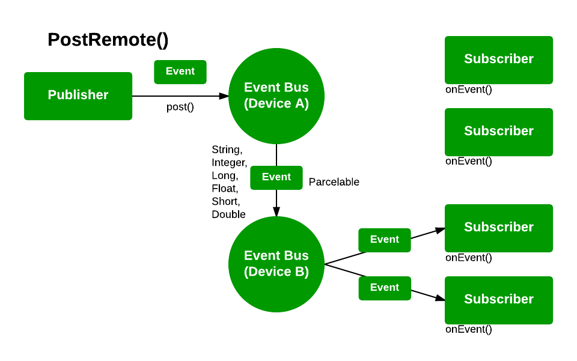
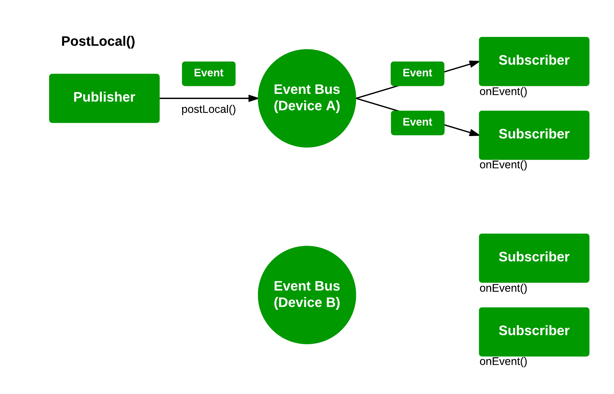

BusWear - EventBus for Android Wear
=======

[](https://maven-badges.herokuapp.com/maven-central/pl.tajchert/buswear)
[](https://android-arsenal.com/details/1/1336)


BusWear (:bus::watch:) is a simple library for EventBus to support Android Wear devices. Just adding one line of code lets you get synchronized event buses on Wear and mobile platform.


###What is EventBus?

A great multi-purpose tool for Android apps, way of triggering some events in separate Activity, Fragment, Service etc. [EventBus, origin of that project](https://github.com/greenrobot/EventBus) or [Otto](https://github.com/square/otto).

###How to start?

To start with BusWear all you need is to add a dependency. That is it!

###Add BusWear to your project

Gradle:
```gradle
    //library:
    compile 'pl.tajchert:buswear:0.9.5'
    //needed dependency:
    compile 'com.google.android.gms:play-services-wearable:+'
```

Maven:
```xml
<dependency>
    <groupId>pl.tajchert</groupId>
    <artifactId>buswear</artifactId>
    <version>0.9.5</version>
</dependency>
```

[Maven Central Link](http://search.maven.org/#search%7Cga%7C1%7Cg%3A%22pl.tajchert%22%20AND%20a%3A%22buswear%22)


###How to use?

You can post to remote branch as long as it `String, Integer, Long, Short, Float, Double` or custom object that `implements Parcelable`, other "non-Parcelable" objects still can be posted but only locally.


`post(object);` sends your parcelable object (or `String, Integer`...) both to local bus and to remote one as well.

`postLocal(object)` works as old `post()` of EventBus, it sends event only locally.

`postRemote(object)` sends your parcelable object (or `String, Integer`...) to remote bus only.

The same goes for **Sticky events** - so you get `postSticky()`, `postStickyLocal()`, `postStickyRemote()`. Also methods such `removeStickyEvent(Object)`, `removeStickyEvent(Class)`, `removeAllStickyEvents()` work in same manner - you get everywhere, remote, local flavours of each method.


###Sample

To send:

```java
EventBus.getDefault(this).post(parcelableObject);     //Custom parcelable object
EventBus.getDefault(this).postRemote("text");         //String
//... similar with Integer, Long etc.
EventBus.getDefault(this).postLocal('c');            //Character - to local function you can pass any object that you like
```

To receive:
```java
protected void onCreate(Bundle savedInstanceState) {
    EventBus.getDefault(this).register(this);
}

//Called every time when post() is sent (with that particular object), needs to be annotated with the `@Subscribe` annotation.

@Subscribe(threadMode = ThreadMode.MAIN)
public void onMyEvent(ParcelableObject parcelableObject){
    //Do your stuff with that object
}

@Subscribe(threadMode = ThreadMode.MAIN)
public void onMyOtherEvent(String text){
    //Do your stuff with that object
}

//... more onXEvent() with @Subscribe annotation if you want!
```

###Event propagation


------------------------

------------------------


###Questions?

**How is that better than classic EventBus?**

_EventBus works on mobile na Android Wear - yes, but you got two separate buses, and BusWear gives you a feel of one bus that is shared/synchronized between those two devices._

**What are some drawbacks?**

_Probably quite big one is that all your custom objects to be posted needs to implement `Parcelable` (or be `String, Integer...`)._

_Other one is that you cannot have classes with same name in the same module (for example "wear") - it will lead to errors as matching is done on SimpleName of class._

###License

BusWear binaries and source code can be used according to the [Apache License, Version 2.0](LICENSE).

###Thanks

Goes to [Polidea](https://www.polidea.com/) for putting me on a project that encouraged me to work on that library, Maciej Górski for Manifest merger, and Dariusz Seweryn for idea with Class name in path String.
